# FinBuddy C4 Container Diagram

## Architecture Overview

This diagram illustrates the Stealth-Blade modular microservices architecture for FinBuddy, a privacy-first AI-powered personal finance assistant.

```mermaid
C4Container
    title FinBuddy Stealth-Blade Architecture

    Person(user, "User", "FinBuddy app user")

    Enterprise_Boundary(finbuddy, "FinBuddy System") {
        %% Frontend Layer
        Container_Boundary(frontend, "Frontend") {
            Container(sveltekit_app, "SvelteKit App", "SvelteKit, TypeScript", "Progressive Web App with offline-first capabilities")
        }

        %% API Gateway Layer
        Container_Boundary(api_gateway, "API Gateway Layer") {
            Container(api_gateway, "Stealth Proxy", "Node.js, NestJS/Fastify", "TLS termination, rate limiting, routing, API versioning")
            Container(service_mesh, "Service Mesh", "Istio", "mTLS, traffic policies, observability")
        }

        %% Core Blades Layer
        Container_Boundary(core_blades, "Core Blades") {
            Container(auth_blade, "Auth Blade", "NestJS, TypeScript", "Authentication, authorization, user management")
            Container(expense_blade, "Expense Blade", "NestJS, TypeScript", "Expense tracking, categories, CRUD, CSV import/export")
            Container(budget_blade, "Budget Blade", "NestJS, TypeScript", "Budget rules engine, alerts, tracking")
            Container(insights_blade, "Insights Blade", "NestJS, TypeScript", "Spending patterns, linear regression, predictive analytics")
            Container(goal_blade, "Goal Blade", "NestJS, TypeScript", "Financial goals setup, progress tracking, notifications")
            Container(chat_blade, "Chat Blade", "NestJS, TypeScript", "Chat session management, context injection")
            Container(ai_inference, "AI Inference Blade", "Python, FastAPI", "LLM inference, embeddings generation, model management")
            Container(sync_blade, "Sync Blade", "NestJS, TypeScript", "Cloud sync, conflict resolution, offline-first operations")
            Container(notification_blade, "Notification Blade", "NestJS, TypeScript", "Email, push notifications via SendGrid/Firebase")
        }

        %% Data Layer
        Container_Boundary(data_layer, "Data Layer") {
            ContainerDb(postgres, "PostgreSQL", "Database", "Financial data, user data, encrypted at rest")
            ContainerDb(minio, "MinIO", "Object Store", "Model embeddings, backups, files")
            Container(data_blade, "Data Blade", "NestJS, TypeScript", "Data access layer, encryption/decryption")
        }

        %% Event Bus
        Container(event_bus, "Event Bus", "RabbitMQ/Kafka", "Asynchronous events, message queuing")

        %% External Authentication
        System_Ext(keycloak, "Keycloak/Auth0", "OAuth2/JWT provider")
    }

    %% External Services
    System_Ext(email_service, "SendGrid", "Email delivery service")
    System_Ext(push_notification, "Firebase", "Push notification service")

    %% Relationships - User interactions
    Rel(user, sveltekit_app, "Uses", "HTTPS")
    
    %% Frontend to Gateway
    Rel(sveltekit_app, api_gateway, "API requests", "HTTPS, GraphQL/REST")
    
    %% Gateway to Services
    Rel(api_gateway, service_mesh, "Routes requests", "mTLS")
    Rel(service_mesh, auth_blade, "Validates requests", "mTLS")
    Rel(service_mesh, expense_blade, "Routes requests", "mTLS")
    Rel(service_mesh, budget_blade, "Routes requests", "mTLS")
    Rel(service_mesh, insights_blade, "Routes requests", "mTLS")
    Rel(service_mesh, goal_blade, "Routes requests", "mTLS")
    Rel(service_mesh, chat_blade, "Routes requests", "mTLS")
    Rel(service_mesh, sync_blade, "Routes requests", "mTLS")
    Rel(service_mesh, notification_blade, "Routes requests", "mTLS")
    
    %% Chat flow
    Rel(chat_blade, ai_inference, "Sends queries", "mTLS")
    
    %% Auth flows
    Rel(auth_blade, keycloak, "Authenticates", "OAuth2/OIDC")
    
    %% Data access
    Rel_Back(data_blade, postgres, "Reads/Writes", "Encrypted connection")
    Rel_Back(data_blade, minio, "Reads/Writes", "Encrypted connection")
    
    %% Service to Data Blade
    Rel(expense_blade, data_blade, "Uses", "mTLS")
    Rel(budget_blade, data_blade, "Uses", "mTLS")
    Rel(insights_blade, data_blade, "Uses", "mTLS")
    Rel(goal_blade, data_blade, "Uses", "mTLS")
    Rel(chat_blade, data_blade, "Uses", "mTLS")
    Rel(ai_inference, data_blade, "Uses", "mTLS")
    Rel(sync_blade, data_blade, "Uses", "mTLS")
    
    %% Event communication
    Rel(expense_blade, event_bus, "Publishes events", "mTLS")
    Rel(budget_blade, event_bus, "Publishes/Subscribes", "mTLS")
    Rel(insights_blade, event_bus, "Subscribes", "mTLS")
    Rel(notification_blade, event_bus, "Subscribes", "mTLS")
    
    %% External notifications
    Rel(notification_blade, email_service, "Sends emails", "HTTPS")
    Rel(notification_blade, push_notification, "Sends notifications", "HTTPS")

    UpdateLayoutConfig($c4ShapeInRow="3", $c4BoundaryInRow="1")
```

## Key Components

1. **Frontend Layer**: SvelteKit Progressive Web App supporting offline-first operations
2. **API Gateway Layer**: Stealth Proxy with Istio Service Mesh for mTLS and zero-trust enforcement
3. **Core Blades Layer**: Isolated microservices for specific domains (Auth, Expense, Budget, etc.)
4. **Data Layer**: Encrypted PostgreSQL for structured data, MinIO for object storage
5. **Event Bus**: RabbitMQ/Kafka for asynchronous communication between blades

## Zero-Trust Implementation

- All service-to-service communication secured via mTLS through Istio service mesh
- API Gateway serves as the only public-facing entry point
- Data encrypted at rest and in transit
- Service-to-service authentication for all internal requests
- Strict network policies controlling which services can communicate