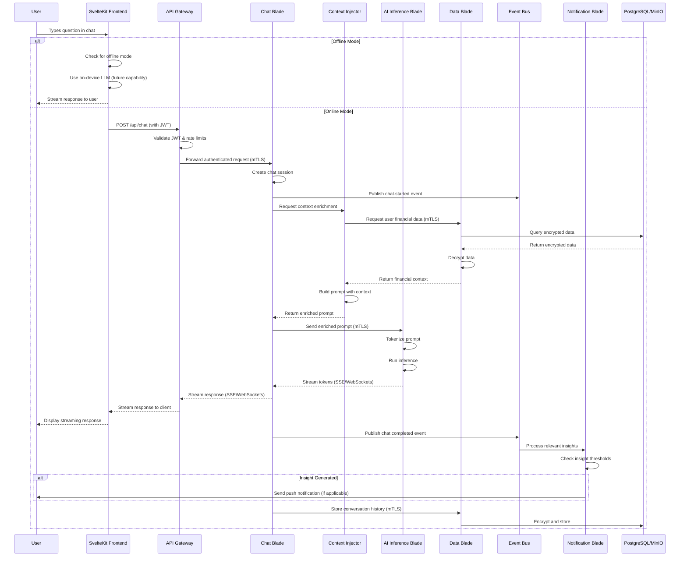

# FinBuddy Chat Flow Sequence Diagram

This diagram illustrates the sequence of interactions when a user asks a question to FinBuddy through the chat interface.

## Key Security Features in the Flow

1. **Authentication & Authorization**
   - JWT validation at API Gateway
   - mTLS for all service-to-service communication

2. **Data Privacy**
   - All financial data encrypted at rest in PostgreSQL/MinIO
   - Data decryption occurs only within authorized Data Blade
   - Context injection performed in isolated service

3. **Zero-Trust Implementation**
   - Each service validates the identity of calling services
   - Least privilege access to data and resources
   - No direct database access from external-facing services

4. **Offline-First Capability**
   - Client determines whether to use local processing or cloud services
   - Sync protocol ensures data consistency when reconnecting

5. **Streaming Architecture**
   - Response tokens streamed from AI to user for responsive experience
   - Event-driven architecture for asynchronous processing